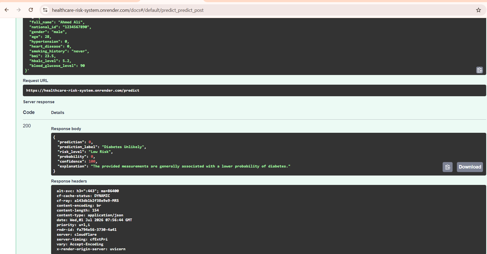
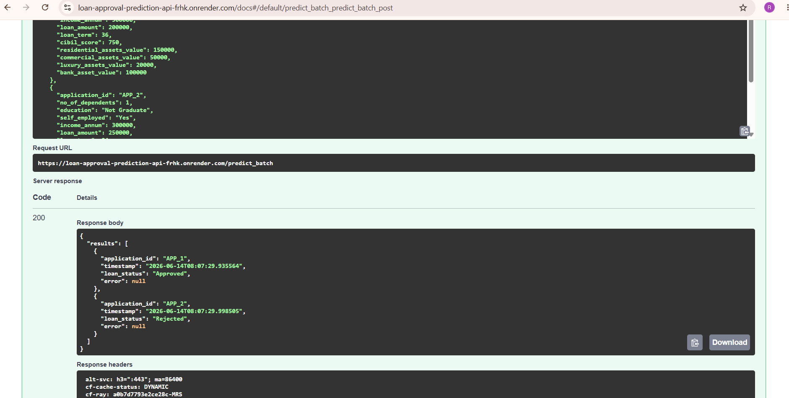

# 👋 Hi, I'm Rehab Alsayed

### Machine Learning Engineer • MLOps • FastAPI • Docker • MLflow • CI/CD

 

  

---

# 🚀 About Me

I'm a **Machine Learning Engineer** passionate about transforming machine learning models into production-ready applications.

I enjoy building complete ML systems—from data preprocessing and model training to API development, containerization, CI/CD pipelines, and cloud deployment.

My current focus is expanding into **NLP**, **Large Language Models (LLMs)**, **LangChain**, and **Retrieval-Augmented Generation (RAG)** while continuing to strengthen my MLOps and AI Engineering skills.

---

# 🛠 Tech Stack

### Languages

### Backend

FastAPI • REST APIs • Pydantic • SQLAlchemy

---

### Machine Learning

- Scikit-learn
- CatBoost
- XGBoost
- Pandas
- NumPy
- MLflow

---

### DevOps & MLOps

Docker • GitHub Actions • CI/CD • Render • SQLite • PostgreSQL

---

# 🚀 Featured Projects

## 🩺 Healthcare Risk Prediction System

Production-ready ML API for diabetes risk prediction.

### Preview

  

### Tech Stack

`FastAPI` `CatBoost` `PostgreSQL` `Docker` `MLflow` `CI/CD`

### Links

- 💻 GitHub Repository  
  https://github.com/rehabalsayed/healthcare-risk-system

- 🌐 Live Demo  
  https://healthcare-risk-system.onrender.com

- 📄 Swagger  
  https://healthcare-risk-system.onrender.com/docs

---

## 💰 Loan Approval Prediction API

Production-ready ML API supporting single and batch loan approval prediction.

### Preview

  

### Tech Stack

`FastAPI` `Random Forest` `SQLite` `Docker` `CI/CD`

### Links

- 💻 GitHub Repository  
  https://github.com/rehabalsayed/loan-approval-prediction-api

- 🌐 Live Demo  
  https://loan-approval-prediction-api-frhk.onrender.com

- 📄 Swagger  
  https://loan-approval-prediction-api-frhk.onrender.com/docs
  
---

# 🔥 GitHub Streak

---

# 📈 Contribution Graph

---

# 🎯 Currently Learning

- 🧠 Natural Language Processing (NLP)
- 🤖 Large Language Models (LLMs)
- 💬 Generative AI
- 🔗 LangChain
- 📚 Retrieval-Augmented Generation (RAG)
- ☸ Kubernetes
- ☁ AWS Cloud
- 🏗 Terraform
- 📊 Monitoring & Observability
- 🚀 Advanced MLOps

---

# 📌 2026 Goals

- ✅ Build production-grade AI applications
- ✅ Master MLOps
- ✅ Learn LLM Engineering
- ✅ Build multiple RAG projects
- ✅ Deploy scalable ML systems
- ✅ Contribute to Open Source
- ✅ Land an ML Engineer / AI Engineer role

---

# 🤝 Let's Connect

I'm always interested in collaborating on Machine Learning, AI, NLP, and MLOps projects.

Feel free to reach out!

📧 Email

**rehab.m.alsayed@gmail.com**

💼 LinkedIn

https://www.linkedin.com/in/rehab-alsayed

💻 GitHub

https://github.com/rehabalsayed

---

# 💡 Quote I Like

> "Machine Learning doesn't end when the model reaches high accuracy.
> That's where the engineering begins."

---

### Thanks for visiting my profile!

⭐ If you find any of my projects useful, feel free to star the repository.

---

